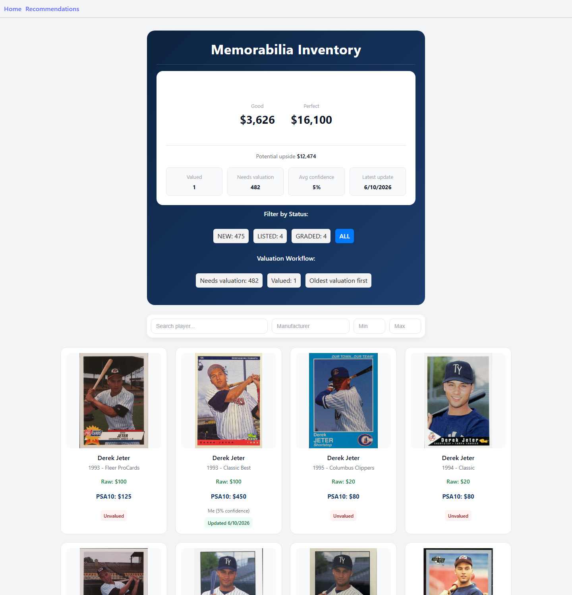
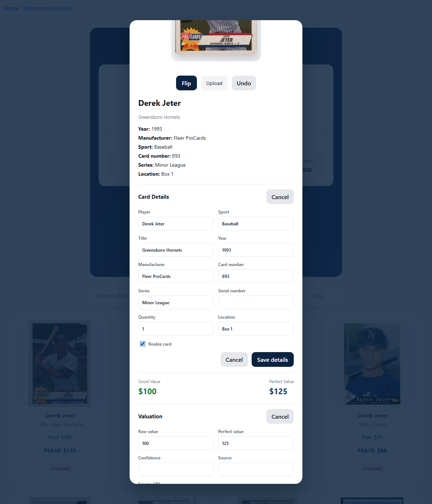
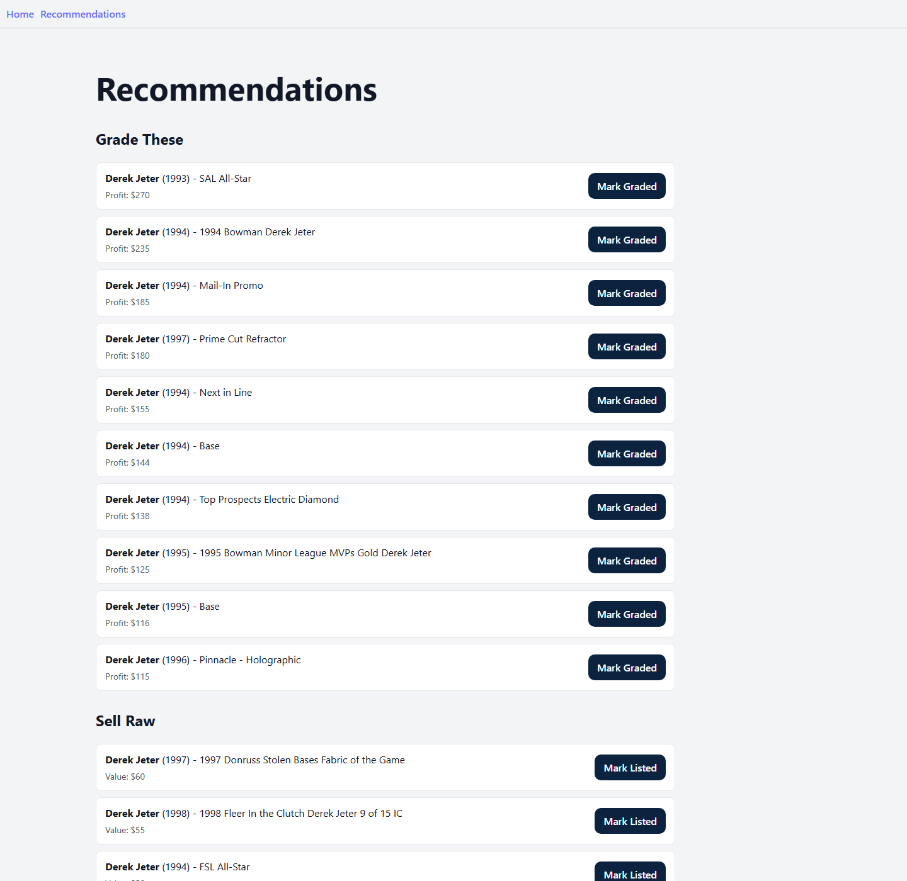
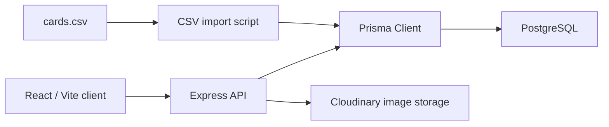

# MemorabiliaDB

MemorabiliaDB is a full-stack sports card inventory app for tracking collection value, valuation confidence, card images, grading candidates, and listing status. It was built as a practical collector workflow: import a CSV, review the inventory, identify cards worth grading, manually update valuation metadata, upload front/back images, and move cards through status states as cards are listed or graded.

## Screenshots

### Inventory



### Card Detail And Valuation Editing



### Recommendations



## Feature Walkthrough

- Inventory dashboard with total estimated raw value, perfect-condition value, and potential upside.
- Valuation progress summary showing valued cards, cards that still need valuation, average confidence, and latest valuation update.
- Paginated card grid with card images, player names, manufacturer/year metadata, raw value, PSA 10-style value, and valuation status badges.
- Filters for player name, manufacturer, year range, card status, valuation status, and oldest valuation review.
- Status tracking for `NEW`, `LISTED`, and `GRADED` cards.
- Card detail modal with front/back image flipping, Cloudinary image upload, and manual valuation editing.
- Manual valuation workflow for raw value, perfect-condition value, source, source URL, confidence, notes, and last-valued timestamp.
- Recommendations page that separates likely grading candidates from cards better suited to sell raw.
- CSV import script for bulk-loading and syncing card data, including optional valuation metadata.
- Centralized client API layer with user-visible loading and error feedback.
- Deployment-ready API configuration for hosted ports and client origins.
- API route tests for the core card workflows.
- GitHub Actions CI for automated API and client verification.

## Tech Stack

| Area | Tools |
| --- | --- |
| Client | React 19, TypeScript, Vite, React Router |
| API | Node.js, Express, TypeScript |
| Database | PostgreSQL, Prisma |
| Validation | Zod |
| Images | Cloudinary, Multer |
| Testing | Vitest, Supertest, ESLint |
| CI | GitHub Actions |

## Architecture



The client talks to the API through a centralized request layer in `memorabilia-client/src/api.ts`. The API exposes card, summary, recommendation, status, valuation, and upload routes, with Prisma handling database access. Image uploads are stored in Cloudinary, while the database stores the resulting image URLs.

Valuation data is intentionally modeled as metadata around the existing value fields rather than as a hard dependency on a third-party price source. Today the app supports manual estimates with source, confidence, notes, and `lastValuedAt`; later, the valuation service can plug in an external provider such as eBay Browse API or PriceCharting without changing the client workflow.

## Valuation Workflow

The valuation workflow is designed to help a collector work through a large inventory methodically:

1. Use the dashboard to see how many cards are valued versus still missing valuation metadata.
2. Select `Needs valuation` to focus only on cards without a valuation timestamp.
3. Open a card and edit raw value, perfect-condition value, source, source URL, confidence, and notes.
4. Save the valuation to update the card, refresh the inventory summary, and change the tile badge from `Unvalued` to `Updated <date>`.
5. Use `Valued` and `Oldest valuation first` to audit older estimates over time.

## Project Structure

```text
memorabiliaDB/
  .github/workflows/ci.yml
  docs/screenshots/
  memorabilia-api/
    server/
      prisma/
      scripts/
      src/
  memorabilia-client/
    src/
```

## Getting Started

### Prerequisites

- Node.js 22 or newer
- PostgreSQL database
- Cloudinary account for image uploads

### API Setup

```bash
cd memorabilia-api/server
npm install
cp .env.example .env
npx prisma migrate dev
npm run dev
```

The API runs at `http://localhost:5000`.

Required API environment variables:

```text
PORT=5000
CLIENT_ORIGIN=http://localhost:5173
DATABASE_URL=
CLOUDINARY_CLOUD_NAME=
CLOUDINARY_API_KEY=
CLOUDINARY_API_SECRET=
```

### Client Setup

```bash
cd memorabilia-client
npm install
cp .env.example .env
npm run dev
```

The client runs at `http://localhost:5173`.

Optional client environment variable:

```text
VITE_API_BASE_URL=http://localhost:5000
```

### Health Check

```bash
curl http://localhost:5000/health
```

Expected response:

```json
{
  "status": "ok",
  "service": "memorabilia-api"
}
```

### Import Sample Data

```bash
cd memorabilia-api/server
npm run import -- ./cards.csv
```

The import script supports these optional valuation columns:

```text
valueSource,valueSourceUrl,valueConfidence,valueNotes,lastValuedAt
```

If a row includes `goodConditionValue` or `perfectConditionValue` but does not include valuation metadata, the importer defaults to:

- `valueSource`: `CSV import`
- `valueConfidence`: `50`
- `lastValuedAt`: the current import timestamp

## Deployment Readiness

The project is not deployed yet, but the configuration is ready for a future hosted setup.

### Planned Client Hosting: Vercel

When deploying the React client to Vercel:

- Root directory: `memorabilia-client`
- Build command: `npm run build`
- Output directory: `dist`
- Environment variable: `VITE_API_BASE_URL=https://your-api-host.example.com`

### Planned API Hosting

The Express API can be hosted on a Node-friendly platform such as Render, Railway, Fly.io, or a similar service.

Recommended API settings:

- Root directory: `memorabilia-api/server`
- Build command: `npm ci && npm run build`
- Start command: `npm start`
- Health check path: `/health`

Required production API environment variables:

```text
PORT=
CLIENT_ORIGIN=https://your-vercel-app.vercel.app
DATABASE_URL=
CLOUDINARY_CLOUD_NAME=
CLOUDINARY_API_KEY=
CLOUDINARY_API_SECRET=
```

`CLIENT_ORIGIN` supports a comma-separated list of allowed origins, which is useful for allowing both local development and a production Vercel URL during staged rollout.

### Database And Storage

- Use a hosted PostgreSQL database and set `DATABASE_URL` on the API host.
- Run Prisma migrations against the production database before starting the API.
- Use Cloudinary for image storage and provide the Cloudinary credentials to the API host.

## Testing And CI

Run the API test suite:

```bash
cd memorabilia-api/server
npm test
```

Build the API:

```bash
cd memorabilia-api/server
npm run build
```

Lint and build the client:

```bash
cd memorabilia-client
npm run lint
npm run build
```

GitHub Actions runs these checks automatically on pushes and pull requests to `main`:

- API: `npm ci`, `npm test`, `npm run build`
- Client: `npm ci`, `npm run lint`, `npm run build`

## API Coverage

Current automated tests cover:

- `GET /health`
- `GET /cards` pagination, filters, summary shape, valuation filtering, and valuation sorting
- `GET /cards/recommendations`
- `PATCH /cards/:id/status` success path
- `PATCH /cards/:id/status` invalid status rejection
- `PATCH /cards/:id/valuation` success path
- `PATCH /cards/:id/valuation` validation rejection

## Roadmap

- Add more API tests for create/update/delete card flows.
- Add frontend component tests for filtering, status changes, and upload feedback.
- Improve the recommendations UI with richer card previews and sorting controls.
- Deploy the client and API after the next feature set is complete.
- Add authentication if the app becomes multi-user.
