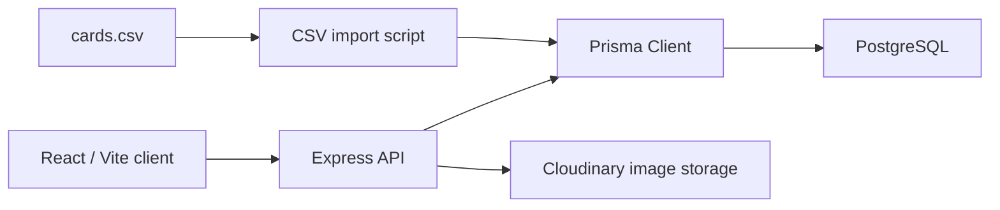

# MemorabiliaDB

MemorabiliaDB is a full-stack sports card inventory app for tracking collection value, card images, grading candidates, and listing status. It was built as a practical collector workflow: import a CSV, review the inventory, identify cards worth grading, upload front/back images, and move cards through status states as they are listed or graded.

## Screenshots

### Inventory


### Recommendations


## Feature Walkthrough

- Inventory dashboard with total estimated raw value, perfect-condition value, and potential upside.
- Paginated card grid with card images, player names, manufacturer/year metadata, raw value, and PSA 10-style value.
- Filters for player name, manufacturer, year range, and status.
- Status tracking for `NEW`, `LISTED`, and `GRADED` cards.
- Card detail modal with front/back image flipping and Cloudinary image upload.
- Recommendations page that separates likely grading candidates from cards better suited to sell raw.
- CSV import script for bulk-loading and syncing card data.
- Centralized client API layer with user-visible loading and error feedback.
- API route tests for the core card workflows.
- GitHub Actions CI for automated API and client verification.

## Tech Stack

| Area | Tools |
| --- | --- |
| Client | React 19, TypeScript, Vite, React Router |
| API | Node.js, Express, TypeScript |
| Database | PostgreSQL, Prisma |
| Validation | Zod |
| Images | Cloudinary, Multer |
| Testing | Vitest, Supertest, ESLint |
| CI | GitHub Actions |

## Architecture



The client talks to the API through a centralized request layer in `memorabilia-client/src/api.ts`. The API exposes card, summary, recommendation, status, and upload routes, with Prisma handling database access. Image uploads are stored in Cloudinary, while the database stores the resulting image URLs.

## Project Structure

```text
memorabiliaDB/
  .github/workflows/ci.yml
  docs/screenshots/
  memorabilia-api/
    server/
      prisma/
      scripts/
      src/
  memorabilia-client/
    src/
```

## Getting Started

### Prerequisites

- Node.js 22 or newer
- PostgreSQL database
- Cloudinary account for image uploads

### API Setup

```bash
cd memorabilia-api/server
npm install
cp .env.example .env
npx prisma migrate dev
npm run dev
```

The API runs at `http://localhost:5000`.

Required API environment variables:

```text
DATABASE_URL=
CLOUDINARY_CLOUD_NAME=
CLOUDINARY_API_KEY=
CLOUDINARY_API_SECRET=
```

### Client Setup

```bash
cd memorabilia-client
npm install
cp .env.example .env
npm run dev
```

The client runs at `http://localhost:5173`.

Optional client environment variable:

```text
VITE_API_BASE_URL=http://localhost:5000
```

### Import Sample Data

```bash
cd memorabilia-api/server
npm run import -- ./cards.csv
```

## Testing And CI

Run the API test suite:

```bash
cd memorabilia-api/server
npm test
```

Build the API:

```bash
cd memorabilia-api/server
npm run build
```

Lint and build the client:

```bash
cd memorabilia-client
npm run lint
npm run build
```

GitHub Actions runs these checks automatically on pushes and pull requests to `main`:

- API: `npm ci`, `npm test`, `npm run build`
- Client: `npm ci`, `npm run lint`, `npm run build`

## API Coverage

Current automated tests cover:

- `GET /cards` pagination, filters, and summary shape
- `GET /cards/recommendations`
- `PATCH /cards/:id/status` success path
- `PATCH /cards/:id/status` invalid status rejection

## Roadmap

- Add more API tests for create/update/delete card flows.
- Add frontend component tests for filtering, status changes, and upload feedback.
- Improve the recommendations UI with richer card previews and sorting controls.
- Add deployment documentation for the client, API, database, and environment variables.
- Add authentication if the app becomes multi-user.
