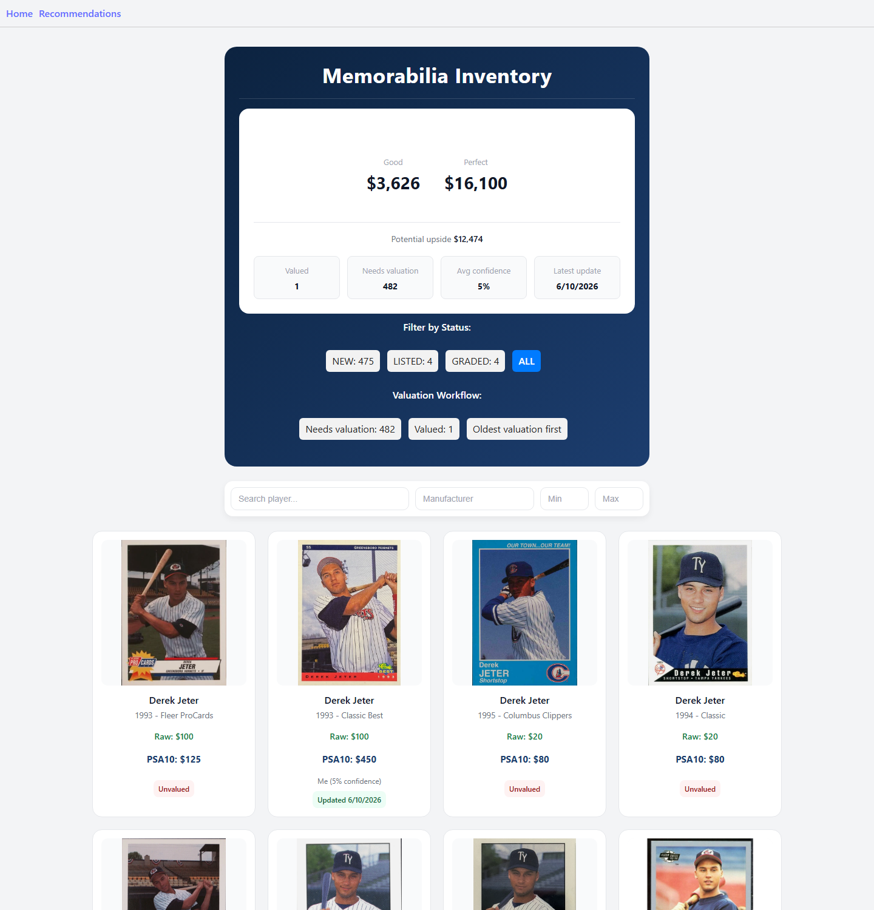
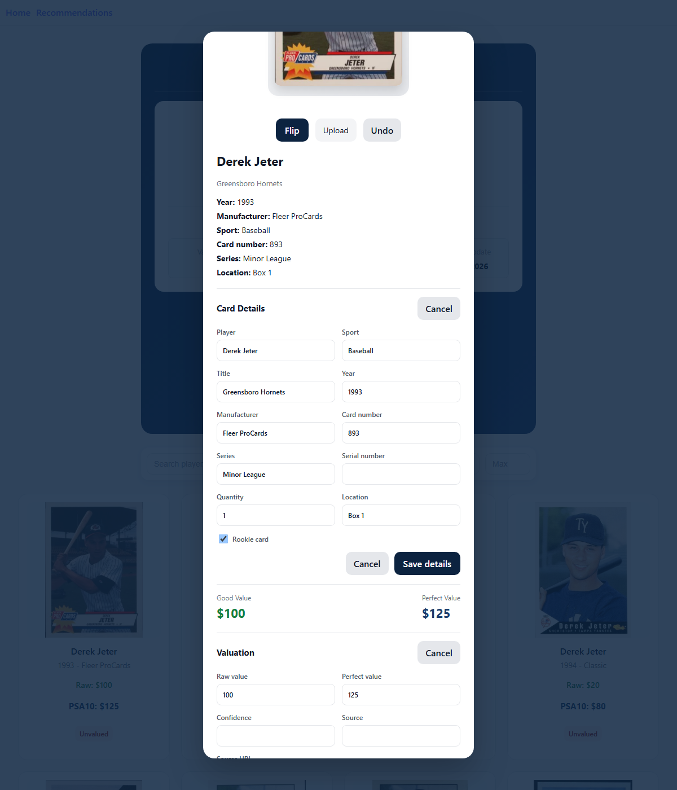
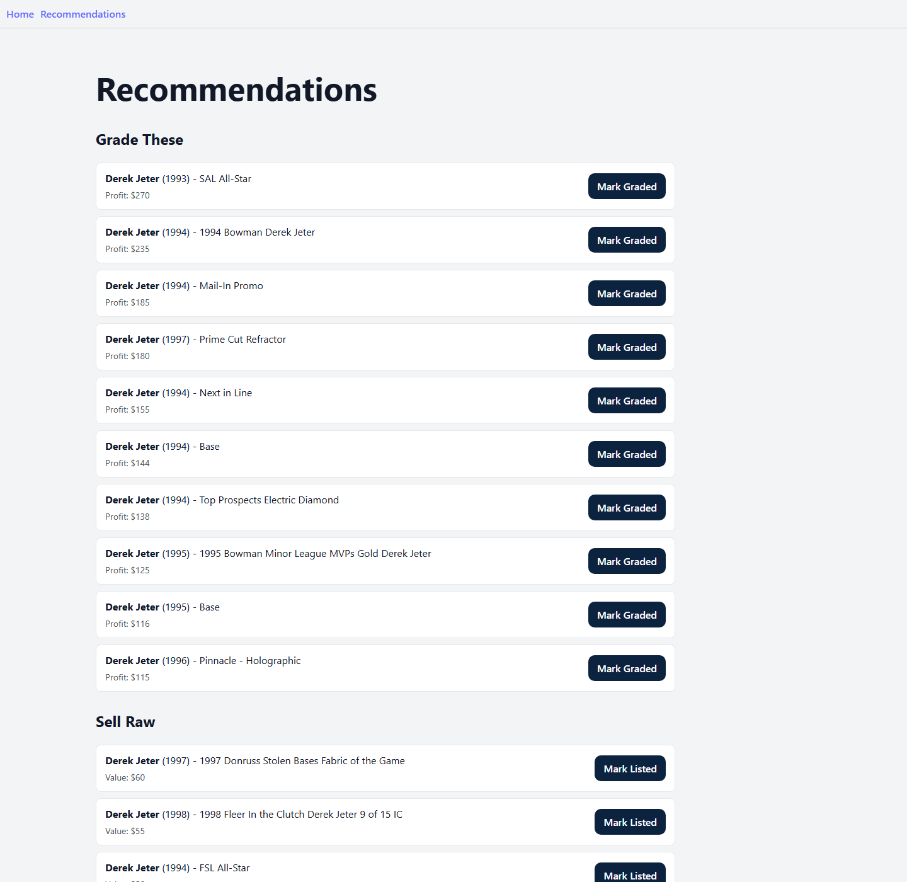
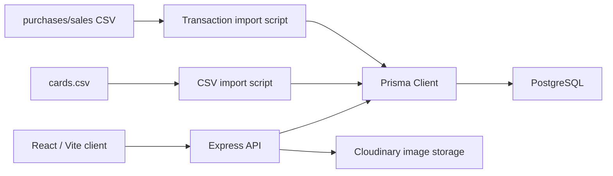

# MemorabiliaDB

MemorabiliaDB is a full-stack sports card seller dashboard for tracking sports card inventory, valuation confidence, card images, grading candidates, listing status, and seller profit. It was built as a practical collector workflow: import an inventory CSV, review the collection, identify cards worth grading, manually update valuation metadata, upload front/back images, move cards through status states, and layer purchase/sale records on top for seller reporting.

## Screenshots

### Inventory



### Card Detail And Valuation Editing



### Recommendations



## Feature Walkthrough

- Inventory dashboard with total estimated raw value, perfect-condition value, and potential upside.
- Seller dashboard snapshot with revenue, cost basis, marketplace fees, shipping, grading, supplies, net profit, and latest monthly profit.
- Realized profit calculations that separate purchase spend from sold-card cost basis.
- Profit breakdowns by month, marketplace, and linked card.
- Seller transaction types for purchases, sales, refunds, returns, and adjustments.
- Lot tracking fields for multi-card purchases or sales.
- In-app CSV importer for purchase and sale ledgers with row validation, preview, and seller summary refresh.
- Valuation progress summary showing valued cards, cards that still need valuation, average confidence, and latest valuation update.
- Paginated card grid with card images, player names, manufacturer/year metadata, raw value, PSA 10-style value, and valuation status badges.
- Filters for player name, manufacturer, year range, card status, valuation status, and oldest valuation review.
- Expanded inventory operations statuses: `NEW`, `READY_TO_LIST`, `LISTED`, `SOLD`, `SHIPPED`, `GRADED`, and `ARCHIVED`.
- Inventory age and listing age tracking from card creation/import and listing dates.
- Stale listing queue with recommended price reductions after 45, 90, and 180 days.
- Structured location workflows for boxes, shelves, binders, consignment, and grading submission batches.
- Create, edit, and safely delete individual inventory records from the client.
- Card detail modal with front/back image flipping, Cloudinary image upload, and manual valuation editing.
- Listing workflow fields for marketplace, listing URL, asking price, listed date, and sold date.
- Transactions page for reviewing, filtering, editing, and deleting seller ledger entries.
- Manual purchase and sale entry from the Transactions page.
- Card-linked purchase and sale entry from the card detail modal.
- Manual valuation workflow for raw value, perfect-condition value, source, source URL, confidence, notes, and last-valued timestamp.
- Recommendations page that separates likely grading candidates from cards better suited to sell raw.
- CSV import script for bulk-loading and syncing card data, including optional valuation metadata.
- Separate transaction CSV import script for purchases and sales without mutating the source inventory CSV.
- Centralized client API layer with user-visible loading and error feedback.
- Deployment-ready API configuration for hosted ports and client origins.
- API route tests for the core card workflows.
- GitHub Actions CI for automated API and client verification.

## Tech Stack

| Area | Tools |
| --- | --- |
| Client | React 19, TypeScript, Vite, React Router |
| API | Node.js, Express, TypeScript |
| Database | PostgreSQL, Prisma |
| Validation | Zod |
| Images | Cloudinary, Multer |
| Testing | Vitest, Supertest, ESLint |
| CI | GitHub Actions |

## Architecture


```mermaid
flowchart LR
  Client["React / Vite client"] --> API["Express API"]
  API --> Prisma["Prisma Client"]
  Prisma --> DB["PostgreSQL"]
  API --> Cloudinary["Cloudinary image storage"]
  CSV["cards.csv"] --> Import["CSV import script"]
  Import --> Prisma
  LedgerCSV["purchases/sales CSV"] --> LedgerImport["Transaction import script"]
  LedgerImport --> Prisma
```

The client talks to the API through a centralized request layer in `memorabilia-client/src/api.ts`. The API exposes card, summary, recommendation, seller transaction, status, valuation, and upload routes, with Prisma handling database access. Image uploads are stored in Cloudinary, while the database stores the resulting image URLs.

Valuation data is intentionally modeled as metadata around the existing value fields rather than as a hard dependency on a third-party price source. Today the app supports manual estimates with source, confidence, notes, and `lastValuedAt`; later, the valuation service can plug in an external provider such as eBay Browse API or PriceCharting without changing the client workflow.

Seller data is modeled as a ledger layered on top of inventory. `cards.csv` can remain the real source inventory file, while purchases, sales, refunds, returns, and adjustments are imported separately as transaction records. This keeps the original inventory stable and gives the app room to calculate profit, tax reports, inventory age, listing performance, and grading return-on-investment from auditable seller events.

## Valuation Workflow

The valuation workflow is designed to help a collector work through a large inventory methodically:

1. Use the dashboard to see how many cards are valued versus still missing valuation metadata.
2. Select `Needs valuation` to focus only on cards without a valuation timestamp.
3. Open a card and edit raw value, perfect-condition value, source, source URL, confidence, and notes.
4. Save the valuation to update the card, refresh the inventory summary, and change the tile badge from `Unvalued` to `Updated <date>`.
5. Use `Valued` and `Oldest valuation first` to audit older estimates over time.

## Seller Ledger Workflow

The seller dashboard starts with a transaction ledger for purchases, sales, refunds, returns, and adjustments:

1. Keep `memorabilia-api/server/cards.csv` as the current inventory source.
2. Create a separate CSV for purchases, sales, or marketplace exports.
3. Import the ledger CSV from the dashboard with the `Purchases And Sales` importer, or use `npm run import:transactions -- ./your-transactions.csv`.
4. Use the `Transactions` page to review, filter, edit, or delete imported ledger rows.
5. Add individual purchase or sale records manually from the `Transactions` page.
6. Open a card detail modal to add a purchase or sale already linked to that card.
7. Use the dashboard totals as the foundation for future profit and tax reporting.

Supported transaction CSV columns:

```text
type,occurredAt,amount,amountCents,costBasis,costBasisCents,cardId,cardSlug,quantity,lotName,lotCardCount,marketplace,orderId,marketplaceFees,shippingCost,gradingCost,suppliesCost,notes
```

Notes:

- `type` must be `PURCHASE`, `SALE`, `REFUND`, `RETURN`, or `ADJUSTMENT`.
- `occurredAt` accepts a date such as `2026-08-27`.
- Use either `amount` in dollars, such as `24.99`, or `amountCents`, such as `2499`.
- Use `costBasis` or `costBasisCents` on sales to record the realized inventory cost of the card or lot that sold.
- `cardId` or `cardSlug` can link a transaction to an inventory card, but either may be left blank for now. The in-app CSV importer supports both.
- `lotName` and `lotCardCount` can describe multi-card lots when one transaction covers several cards.
- Cost columns use dollar amounts and are included in net profit.

Profit reporting separates inventory purchasing from realized profit:

- `purchaseSpendCents` tracks money spent acquiring inventory.
- `realizedCostBasisCents` tracks the cost basis assigned to cards or lots when they sell.
- Sales add revenue and realized cost basis.
- Refunds and returns reduce revenue and reverse any provided cost basis.
- Adjustments add positive profit-impacting corrections.
- Net profit is calculated after realized cost basis, marketplace fees, shipping, grading, and supplies.

## Listing Workflow

Each card can now track listing metadata directly from the card detail editor:

- Marketplace
- Listing URL
- Asking price
- Listed date
- Sold date

These fields are mutable app workflow data and do not require changing the current inventory CSV. They are separate from seller transaction records so a card can be listed before a sale exists, and a sale can still be recorded later with exact fees, shipping, grading, and supplies.

## Inventory Operations

The inventory workflow supports a broader operational status pipeline:

```text
NEW -> READY_TO_LIST -> LISTED -> SOLD -> SHIPPED -> ARCHIVED
```

`GRADED` remains available for cards that have returned from grading or are tracked as graded inventory. The dashboard status filters show all workflow statuses, and the card detail editor can update status alongside location and listing fields.

Operational location fields are separate from the original freeform `location` note:

- `locationType`: box, shelf, binder, consignment, grading submission, or other
- `locationDetail`: the box, shelf, or binder identifier
- `consignmentPartner`: the partner holding the card
- `gradingSubmissionBatch`: the batch identifier for cards currently in grading workflow

The dashboard also tracks inventory age from the card creation/import date and listing age from `listedAt`. Listings older than 45 days receive a price-reduction recommendation:

- 45-89 days: reduce by 10%
- 90-179 days: reduce by 15%
- 180+ days: reduce by 20%

Use the `Stale listings` filter to turn those recommendations into a focused repricing queue.

## Project Structure

```text
memorabiliaDB/
  .github/workflows/ci.yml
  docs/screenshots/
  memorabilia-api/
    server/
      prisma/
      scripts/
      src/
  memorabilia-client/
    src/
```

## Getting Started

### Prerequisites

- Node.js 22 or newer
- PostgreSQL database
- Cloudinary account for image uploads

### API Setup

```bash
cd memorabilia-api/server
npm install
cp .env.example .env
npx prisma migrate dev
npm run dev
```

The API runs at `http://localhost:5000`.

Required API environment variables:

```text
PORT=5000
CLIENT_ORIGIN=http://localhost:5173
DATABASE_URL=
CLOUDINARY_CLOUD_NAME=
CLOUDINARY_API_KEY=
CLOUDINARY_API_SECRET=
```

### Client Setup

```bash
cd memorabilia-client
npm install
cp .env.example .env
npm run dev
```

The client runs at `http://localhost:5173`.

Optional client environment variable:

```text
VITE_API_BASE_URL=http://localhost:5000
```

### Health Check

```bash
curl http://localhost:5000/health
```

Expected response:

```json
{
  "status": "ok",
  "service": "memorabilia-api"
}
```

### Import Sample Data

```bash
cd memorabilia-api/server
npm run import -- ./cards.csv
```

The import script supports these optional valuation columns:

```text
valueSource,valueSourceUrl,valueConfidence,valueNotes,lastValuedAt
```

If a row includes `goodConditionValue` or `perfectConditionValue` but does not include valuation metadata, the importer defaults to:

- `valueSource`: `CSV import`
- `valueConfidence`: `50`
- `lastValuedAt`: the current import timestamp

## Deployment Readiness

The project is not deployed yet, but the configuration is ready for a future hosted setup.

### Planned Client Hosting: Vercel

When deploying the React client to Vercel:

- Root directory: `memorabilia-client`
- Build command: `npm run build`
- Output directory: `dist`
- Install command: `npm install` (or leave Vercel's default enabled)
- Environment variable: `VITE_API_BASE_URL=https://your-api-host.example.com`

Do not set the build command to `vite build` directly. The project build script also runs TypeScript compilation and uses the locally installed Vite binary.

### Planned API Hosting

The Express API can be hosted on a Node-friendly platform such as Render, Railway, Fly.io, or a similar service.

Recommended API settings:

- Root directory: `memorabilia-api/server`
- Build command: `npm ci && npm run build`
- Start command: `npm start`
- Health check path: `/health`

Required production API environment variables:

```text
PORT=
CLIENT_ORIGIN=https://your-vercel-app.vercel.app
DATABASE_URL=
CLOUDINARY_CLOUD_NAME=
CLOUDINARY_API_KEY=
CLOUDINARY_API_SECRET=
```

`CLIENT_ORIGIN` supports a comma-separated list of allowed origins, which is useful for allowing both local development and a production Vercel URL during staged rollout.

### Database And Storage

- Use a hosted PostgreSQL database and set `DATABASE_URL` on the API host.
- Run Prisma migrations against the production database before starting the API.
- Use Cloudinary for image storage and provide the Cloudinary credentials to the API host.

## Testing And CI

Run the API test suite:

```bash
cd memorabilia-api/server
npm test
```

Build the API:

```bash
cd memorabilia-api/server
npm run build
```

Lint and build the client:

```bash
cd memorabilia-client
npm run lint
npm run build
```

GitHub Actions runs these checks automatically on pushes and pull requests to `main`:

- API: `npm ci`, `npm test`, `npm run build`
- Client: `npm ci`, `npm run lint`, `npm run build`

## API Coverage

Current automated tests cover:

- `GET /health`
- `GET /cards` pagination, filters, summary shape, valuation filtering, and valuation sorting
- `GET /cards` stale-listing filtering and price-reduction recommendations
- `GET /seller/summary` seller revenue, cost, net profit, and monthly calculations
- `GET /seller/summary` marketplace and linked-card profit breakdowns
- `GET /seller/transactions` filtering, pagination, and linked card details
- `POST /seller/transactions` transaction creation and validation rejection
- `PATCH /seller/transactions/:id` transaction updates without defaulting untouched fields
- `DELETE /seller/transactions/:id` transaction deletion
- `POST /seller/transactions/import` batch import and card slug linking
- `GET /cards/recommendations`
- `POST /cards` card creation and slug generation
- `PATCH /cards/:id` card detail updates
- `PATCH /cards/:id/status` success path
- `PATCH /cards/:id/status` invalid status rejection
- `PATCH /cards/:id/valuation` success path
- `PATCH /cards/:id/valuation` validation rejection
- `DELETE /cards/:id` card deletion

## Roadmap

- Add frontend component tests for filtering, status changes, and upload feedback.
- Add inventory age and price-reduction recommendations.
- Add grading submission batches for PSA, SGC, and Beckett.
- Add marketplace fee presets for faster seller transaction entry.
- Improve the recommendations UI with richer card previews and sorting controls.
- Deploy the client and API after the next feature set is complete.
- Add authentication if the app becomes multi-user.
